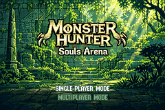

# Monster Hunter — Souls Arena (Shining Soul II / GBA)

Versão 0.3, atualizada em 07/10/2026. Mod experimental single player: um hub
de lojas, pergaminhos de missão e quatro arenas de chefes do jogo original.
As alterações de gameplay estão na ROM; a bridge Lua é opcional para diagnóstico.



## Jogar a versão pública

Este repositório distribui **um patch BPS**, não uma ROM do jogo. Use sua própria
cópia de **Shining Soul II (USA)**, com 16 MiB e SHA-256:

```
b31c19d2d25683a0941d5d501912b5f21d4590cd7071fa01882e62aa5227a7c9
```

Aplique `release/Monster-Hunter-Souls-Arena-v0.3-native-audio.bps` com um
aplicador BPS, ou com Python 3, sem dependências adicionais:

```sh
python3 tools/apply_patch.py "Shining Soul II (USA).gba" \
  release/Monster-Hunter-Souls-Arena-v0.3-native-audio.bps \
  "Monster Hunter Souls Arena - v0.3 Native Audio.gba"
```

O aplicador verifica os checksums e recusa sobrescrever um arquivo existente.
Abra a ROM resultante no mGBA e crie um personagem. Não carregue savestates
de builds anteriores. Importação de saves antigos ainda não foi validada.

A versão pública mantém as músicas originais do jogo. A ROM local de teste
usa três temas externos convertidos para o driver nativo; esses áudios não
são redistribuídos aqui. Arte, gameplay e diálogos são iguais nas duas versões.
Os hashes de ambas estão nos manifestos; não confunda os dois arquivos.

## Fluxo atual

1. Personagem novo começa no hub com 1.000 de dinheiro e a abertura do livro pulada.
2. A NPC da lupa reutiliza a prateleira da loja de poções e vende quatro pergaminhos.
3. Comprar adiciona o item à bolsa e toca o som nativo de confirmação.
4. Abra **Start → Item**, pegue o pergaminho com A, selecione **USE** à esquerda
   e confirme. A ativação consome o pergaminho; comprar não ativa automaticamente.
5. A porta superior abre somente com uma hunt ativa.

| Chefe | Preço | Arena |
| --- | ---: | --- |
| Colonel Gobovich | 20 | Goblin Fort — contexto 1, sala 7 |
| Grove Giant | 40 | Contexto 2, sala 9 |
| Wizari | 70 | Contexto 3, sala 14 |
| Clione | 100 | Contexto 4, sala 12 |

Uma hunt vale até **duas mortes**. Na primeira, o jogador volta curado ao hub
e ainda pode reentrar. A arena anterior é encerrada com as rotinas nativas de
limpeza; o chefe reaparece com HP cheio na próxima entrada. Na segunda morte,
o contrato termina e a porta volta a ficar bloqueada. Vencer também encerra
a hunt e retorna ao hub.

Não há diálogo inicial obrigatório nos quatro chefes. Seus scripts originais
continuam na ROM; animações de aparecimento e diálogos de vitória permanecem.
As saídas laterais do hub estão bloqueadas. A saída inferior salva e pergunta,
em **duas telas curtas**, antes da escolha Yes/No:

> Would you like to return main title? (You are currently in single player mode).

Pergaminhos não usados e dinheiro são salvos normalmente. **A hunt ativa não
é persistida no save**: sair para o título/recarregar encerra a ativação.
O Continue retorna ao hub, não à enfermaria original.

## Arte, áudio e ferramentas

A arte de floresta foi refeita com ImageGen a partir das referências fornecidas,
com verdes vivos, logo Monster Hunter e subtítulo Souls Arena. A conversão para
240×160 usa 15 paletas locais RGB555 e preserva o banco da fonte nativa.

Fontes de áudio escolhidas para a versão local:

- Hub: https://www.youtube.com/watch?v=5C21ln9supc
- Batalha: https://www.youtube.com/watch?v=CBgmwMqm3ac
- Menu: https://www.youtube.com/watch?v=Fj4o3q659Z4

Os conversores aplicam filtros, ajuste de volume e uma emenda de loop. O driver
do GBA recebe PCM mono de 8 bits a 10.512 Hz, não MP3. A prévia WAV é de 16 bits;
isso não equivale a uma reorquestração em chiptune. Apenas código e metadados de
conversão são publicados. Não inclua gravações sem permissão de redistribuição.

`tools/v03/runtime.s` contém os novos hooks ARM7TDMI/Thumb.
`tools/v03/build_v03.py` reconstrói a ROM local sobre a v0.2 preservada;
requer essa base privada, os PCM locais e devkitARM. Não é um build do zero
apenas com o clone deste repositório. Para jogar a partir da ROM original,
use o patch BPS acima.

`tools/v03/export_public.py` gera o patch público a partir do build local,
restaurando os quatro ponteiros de músicas originais e removendo integralmente
os três samples, tracks e bancos de instrumentos externos.

## Verificações e limites

Relatórios em `validation/v03` (música customizada) e `validation/v03-public`
(patch público) identificam a ROM pelo SHA-256. Os testes usam cópias temporárias
e o núcleo isolado do mGBA 0.10.5 instalado no Mac do desenvolvimento.

- Quatro arenas: entrada, duas mortes, encerramento das tarefas antigas,
  reentrada com HP cheio e vitória; 12 retornos por variante.
- Compra com som, sem ativação automática, recusa por bolsa cheia/falta de dinheiro.
- Cinco outros NPCs preservados; saídas laterais bloqueadas.
- Duas páginas de confirmação, Yes/No, salvamento, Continue e reset.
- No build local, áudio renderizado pelo jogo e repetição dos três samples.

HP e posições foram ajustados **somente no núcleo de diagnóstico** para acionar
os eventos nativos. Não foi uma campanha inteira vencida manualmente.
Novos chefes, drops/recompensas customizadas, balanceamento, missões persistentes,
economia/fabricação remodeladas, multiplayer e saves antigos continuam fora do escopo.

Veja [TESTE-v0.3.md](TESTE-v0.3.md) para o roteiro completo.

## Organização e preservação

O conteúdo antigo da branch foi substituído pelo estado atual, preservando o
histórico de commits. ROMs completas, saves, savestates, vídeos de diagnóstico,
áudios baixados e arquivos temporários/compilados não entram no Git.
As ROMs original, v0.1 e v0.2 e os saves existentes permanecem locais.

Projeto de fã, sem afiliação com Sega ou Capcom. As marcas e o jogo original
pertencem aos respectivos titulares. Nenhuma ROM comercial é fornecida.
